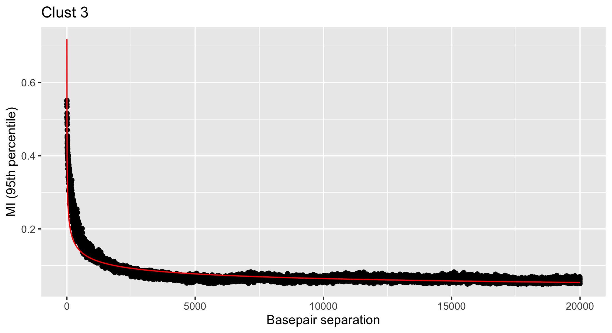
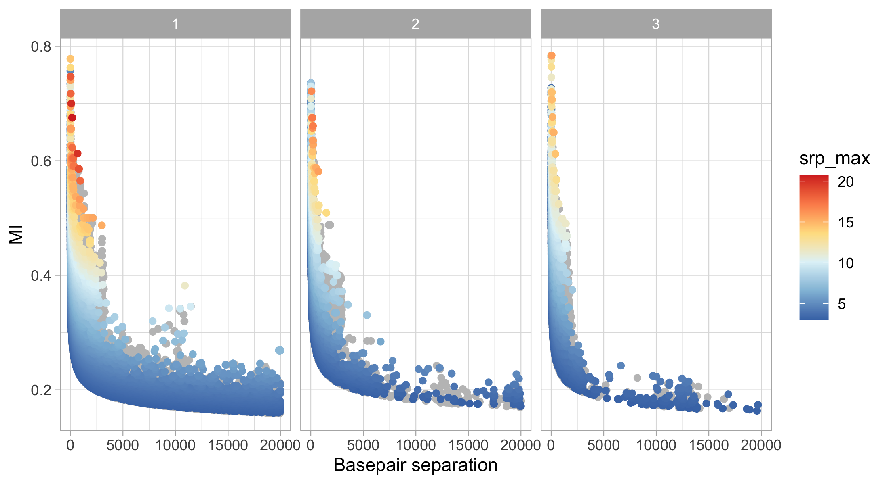

<!-- badges: start -->

[](https://github.com/Sudaraka88/BacGWES/actions)
<!-- badges: end -->

# BacGWES

## Genomewide Search for Evidence of Epistasis and Co-selection in Bacteria

BacGWES takes an alignment of sequences and identifies LD between pairs
of variants that is unusually high given the genomic distance between
the pair, and hence could be due to epistasis. Approximate statistical
significance of pairs is reported, and output from BacGWES can be used
as inputs for GWESExplorer (and other analyses).

## Installation

`BacGWES` is currently available on github. It can be installed with
`devtools`

``` r
install.packages("devtools")
devtools::install_github("Sudaraka88/BacGWES")
```

## Quick Start

To run BacGWES, all you need is a fasta alignment (can be gz compressed)
and the corresponding genbank annotation file with the reference
sequence. A toy dataset is provided in the package itself to confirm
that everything is setup correctly.

> **Note** For GWES analysis, it is recommended to use an alignment with
> a large number of sequences (\>500). Such alignments can be several
> gigabytes in size and not suitable to bundle into an R package.

The toy alignment comprises the first 50kb of 400 *S. pnuemoniae*
isolates (randomy selected from the 616 reported
<a href="https://www.nature.com/articles/ng.2625" target="_blank">here</a>).
The reads were aligned against the
<a href="https://www.ncbi.nlm.nih.gov/nuccore/NC_011900.1" target="_blank">ATCC
700669 reference genome</a> using
<a href="https://github.com/tseemann/snippy" target="_blank">snippy</a>.
Since this is only a part of an alignment, set \<check_gbk_fasta_lengths
= F\>, forcing BacGWES to ignore the mismatch in sequence lengths
between the genbank reference and the fasta alignment. Several
additional options are also used, see `help(package="BacGWES")` for
details.

``` r
# devtools::install_github("Sudaraka88/BacGWES")
library(BacGWES)
dset <- "sample"
aln_path <- system.file("extdata", "sample.aln.gz", package = "BacGWES")
gbk_path <- system.file("extdata", "sample.gbk", package = "BacGWES")
snp_filt_method = "relaxed"
BacGWES(dset = dset, aln_path = aln_path, gbk_path = gbk_path, check_gbk_fasta_lengths = F,
        num_clusts_CDS = 2, SnpEff_Annotate = F, snp_filt_method = snp_filt_method)
```

## Basic Outputs

If the function performs as expceted, all generated output will be saved
to a folder called “sample” in the current working directory, which can
be queried using: `getwd()`. In the example, following files will be
generated in “sample”:

- Figures

  1.  cX_fit.png - shows the distribution and modelling of the
      background linkage disequilibrium (estimated using weighted Mutual
      Information) vs. bp-separation within each cluster (X = 1,2 in the
      example)
  2.  CDS_clustering.png - shows the genome partitioning, based on the
      CDS diversity (compared to the reference sequence)
  3.  sr_gwes_clust.png - short-range GWES plot for each cluster (2 in
      this case)
  4.  sr_gwes_combi.png - combined short-range GWES plot (for links with
      bp positions spanning two clusters, the max srp_value is used)
  5.  lr_gwes.png - Long range GWES plot (similar to the output from
      <a href="https://github.com/santeripuranen/SpydrPick" target="_blank">SpydrPick</a>)

- Outputs

  6.  sr_links.tsv - tab separated file containing details on
      short-range links (i.e. links \<= sr_dist bp apart)
  7.  lr_links.tsv - tab separated file containing details on long-range
      links (i.e. links \> sr_dist bp apart)

> **Note** The default sr_dist value in BacGWES is 20000bp, this can be
> modified using the \<sr_dist\> option.

- Temporary files - used to avoid costly recomputations. These files
  should be deleted before repeating an analysis using the same \<dset\>
  name.

  5.  cds_var.rds - list comprising alignment diversity information
  6.  hdw.rds - named vector comprising Hamming distance weights for
      each sequence
  7.  parsed_gbk.rds - GenBankRecord of the genbank annotation data
  8.  snp_ACGTN.rds - list comprising sparse SNP data from the alignment

## Performing Annotations

Additionally, BacGWES has an interface to perform detailed annotations
using
<a href="https://pcingola.github.io/SnpEff/" target="_blank">SnpEff</a>.
Once downloaded, set the two options: \<SnpEff_Annotate = T\> and
\<snpeff_jar_path = path_to\_\[snpEff.jar\]\_file\>.

> **Note** Since the genbank annotation file is provided, it is
> unnecessary to download and setup any snpEff databases, only the
> \<snpEff.jar\> file is required to perform annotations.

This will create additional outputs in the \<dset\> folder.

- Outputs

  9.  annotations.tsv - tab separated file containing full snpEff
      annotations on each site associated with a short-range GWES link
      with srp_max \> srp_cutoff
  10. sr_links_annotated.tsv - tab separated file similar to
      sr_links.tsv with additional snpEff annotation and allele
      distribution information
  11. tophits.tsv - tab separated file containing the top <max_tophits>
      links. Several filters are applied to extract the top links from
      sr_links_annotated.tsv
  12. Tanglegram - folder compirising html tanglegrams to easily
      visualise links and the corresponding genomic regions
  13. GWESExplorer - folder containing the outputs necessary to explore
      short-range GWES links using
      <a href="https://github.com/jurikuronen/GWES-Explorer" target="_blank">GWESExplorer</a>

> **Note** The default srp_cutoff is 3 (i.e. p=0.001). Short-range links
> with p\>0.001 are automatically discarded, this can be modified using
> the \<srp_cutoff\> option. The default max_tophits value is 250, this
> can be modified using the \<max_tophits\> option.

- Temporary files created for snpEff annotations

  14. snpEff_data - data folder for snpEff
  15. snpEff.config - configuration file for snpEff
  16. sr_annotataed_stats.genes.txt - annotations and statistics in tab
      separated format
  17. sr_annotated_stats.html - annotations and statistics in html
      format
  18. sr_snps.vcf, sr_snps_ann.vcf - input and output from the snpEff
      annotation pipeline

## Detailed Workthrough using Real Data

The following analysis demonstrates all the current options available in
BacGWES. The alignment with 616 *S. pnuemoniae* isolates is available
<a href="https://cloudstor.aarnet.edu.au/plus/s/KBRnIt1H6XZ2XFR" target="_blank">here</a>.
The sample.gbk annotation is the requirement for this alignment, it is
also available
<a href="https://www.ncbi.nlm.nih.gov/nuccore/NC_011900.1?report=gbwithparts&log$=seqview" target="_blank">here</a>.

For this example, the work directory is set to `~/BacGWES_run` and the
<a href="https://cloudstor.aarnet.edu.au/plus/s/KBRnIt1H6XZ2XFR" target="_blank">alignment</a>
and the \<snpEff.jar\> file are available in the same folder. The
following should work:

``` r
library(BacGWES)
dset <- "msch"
aln_path <- "~/BacGWES_run/spn23f_msch.aln.gz"
gbk_path <- system.file("extdata", "sample.gbk", package = "BacGWES")
snpeff_jar_path <- "~/BacGWES_run/snpEff.jar"
BacGWES::BacGWES(dset = dset, aln_path = aln_path, gbk_path = gbk_path, snpeff_jar_path = snpeff_jar_path)
```

While the `BacGWES::BacGWES()` one-liner function is generally versatile
for most analyses, it is possible to write a customised pipeline using
package functions. For a full list of available functions and options,
see: `help(package="BacGWES")`.

``` r
library(BacGWES)
dset <- "msch"
dir.create(dset) # folder to save outputs

aln_path <- "~/BacGWES_run/spn23f_msch.aln.gz"
gbk_path <- system.file("extdata", "sample.gbk", package = "BacGWES")
snpeff_jar_path <- "~/BacGWES_run/snpEff.jar"
ncores = parallel::detectCores()

snp.dat = BacGWES::parse_fasta_alignment(aln_path = aln_path) # parse the alignment and extract SNPs
gbk = BacGWES::parse_genbank_file(gbk_path = gbk_path, g = snp.dat$g) # parse the annotation
cds_var = BacGWES::estimate_variation_in_CDS(gbk = gbk, snp.dat = snp.dat, 
                                             ncores = ncores, 
                                             num_clusts_CDS = 3, 
                                             clust_plt_path = file.path(dset, "CDS_clustering.png"))
```


``` r
hdw = BacGWES::estimate_Hamming_distance_weights(snp.dat = snp.dat) # Hamming distance weights
# Perform MI computation model fitting and ARACNE - this will take some time...
max_blk_sz = 10000 # This is the default value, reduce as required depending on RAM availability...
sr_links = BacGWES::perform_MI_computation(snp.dat = snp.dat, hdw = hdw, cds_var = cds_var, ncores = ncores,
                                           lr_save_path = file.path(dset, "lr_links.tsv"), sr_save_path = file.path(dset, "sr_links.tsv"),
                                           plt_folder = dset, max_blk_sz = max_blk_sz)
```

 


``` r
# Read in the saved lr_links
lr_links = read.table(file.path(dset, "lr_links.tsv"), sep = '\t') # This is written as a tsv file, need to load for plotting
colnames(lr_links) = c("pos1", "pos2", "c1", "c2", "len", "MI")

BacGWES::make_gwes_plots(lr_links = lr_links, sr_links = sr_links, plt_folder = dset)
```

 

``` r
# Identify the top hits by performing snpEff annotations
tophits = BacGWES::perform_snpEff_annotations(dset_name = dset, annotation_folder = file.path(getwd(), dset),
                                                  snpeff_jar = snpeff_jar_path, gbk = gbk, gbk_path = gbk_path,
                                                  cds_var = cds_var, sr_links = sr_links, snp.dat = snp.dat,
                                                  tophits_path = file.path(dset, "tophits.tsv"))
```

This will generate several outputs comprising annotations into the
\<msch\> folder, please refere to Performing Annotations section above.

``` r
# Generate tanglegram
BacGWES::create_tanglegram(srlinks_tophits = tophits, gbk = gbk, tanglegram_folder = file.path(dset, "Tanglegram"))
```

Above line will create 5 tanglegrams in html format, the first one
should look like this: 

``` r
# Generate output required for GWESExplorer
BacGWES::write_output_for_gwes_explorer(snp.dat = snp.dat, srlinks_tophits = tophits, gwes_explorer_folder = file.path(dset, "GWESExplorer"))
```

Above line will create three files in \<msch/GWESExplorer\> that can be
used as inputs for
<a href="https://github.com/jurikuronen/GWES-Explorer" target="_blank">GWESExplorer</a>.
In addition to these, it is possible to provide a GFF3 annotation file,
phenotype data and a sequence tree into GWESExplorer for enhanced
visualisation. The circular GWESExplorer plot should look like this:

